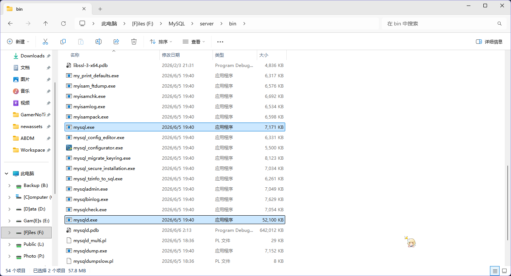
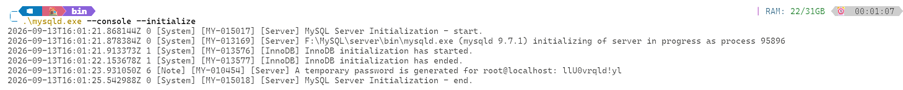
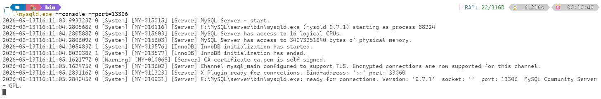
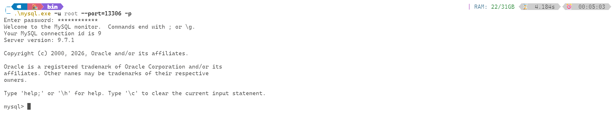
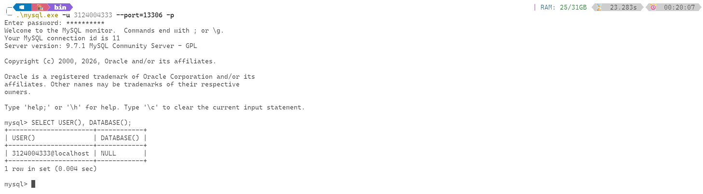

# 作业2

1. 下载解压版mysql，注意不能是安装版本
2. 初始化数据
3. 以root身份登录，创建以自己学号学用户名的账号
4. 截图前将命令行窗口背景设置为白色，字体设置为黑色。
5. 用md格式撰写对应的实验报告，保存在作业根目录，文件名为“作业2.md”

## 个人报告

### 安装并初始化 MySQL

我用的是 MySQL 官网的最新的 Community 版本，本来想用 Docker 的，但是考虑到太赖皮了算了

下载好后，可执行文件在 bin 里面



初始化用 `.\mysqld.exe --console --initialize` 就行，然后会初始化到上层目录的 `data` 目录中




搞定了重启一下 `mysqld`，用 console 一会方便关，顺带改一下 port

```bash
$ mysqld --console --port=13306
```



### 登录并创建账户

登录用到同目录下的 `mysql.exe`，刚刚可以看到临时密码是 `llU0vrqld!yl`，所以直接登录

```bash
$ mysql -u root --port=13306 -p
```

然后输入刚刚显示的密码，就进去了



改一下 root 的密码为 root

```sql
ALTER USER 'root'@'localhost' IDENTIFIED BY 'root';
```

然后按照要求新建一个我们的账户，顺带给权限（不是文档上怎么写成 `.` 而不是 `*.*` 啊）

```sql
CREATE USER '3124004333'@'localhost' IDENTIFIED BY '3124004333';
GRANT ALL ON *.* TO '3124004333'@'localhost';
```

这样就完成了我们 `3124004333` 这个用户对所有数据库的所有表的权限变更

### 登录个人账户验证

用对应的命令登录数据库

```bash 
$ mysql -u 3124004333 --port=13306 -p
```

然后输入密码，发现成功登录，尝试查询数据库信息

```sql
SELECT USER(), DATABASE();
```

发现也能成功进行，说明添加成功了


