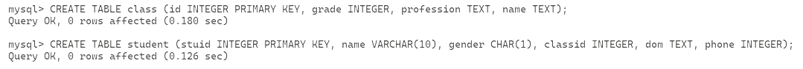
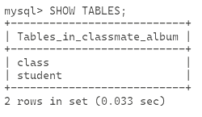
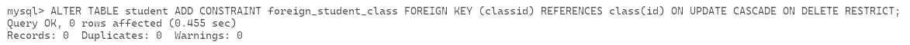
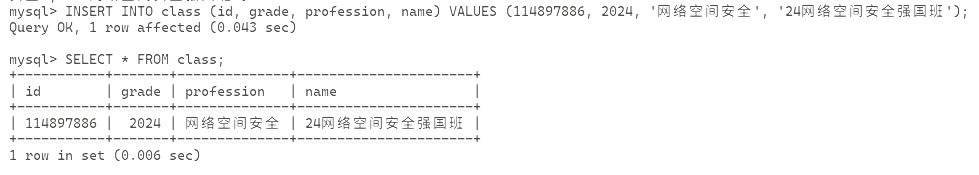
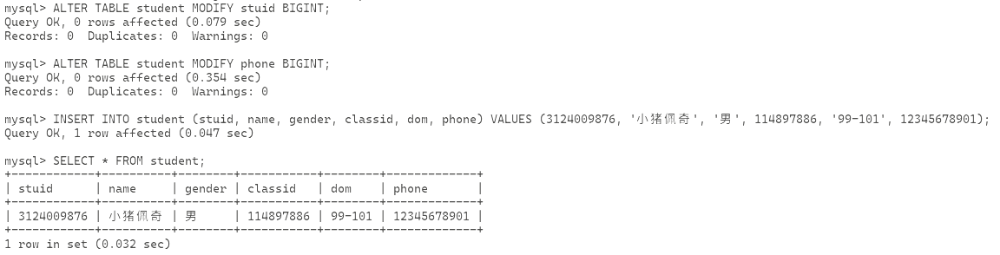
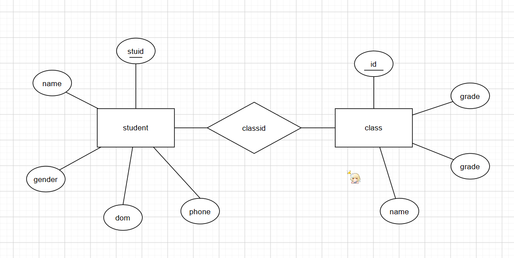

# 作业3

1. 对第一次作业中的系统，建立数据模型，绘制E-R图，并给出解释。
2. 题目中需要使用多个数据对象，并可以实现这些数据之间的关联。
3. 作业使用md格式保存信息，保存在作业根目录，文件名为“作业3.md”

---

## 个人解答

就还是用那个简单的同学录例子吧，假设我们有多个班级，班级具有以下信息

- <u>id</u> (INTEGER)
- 年级 grade (INTEGER)
- 专业 profession (TEXT)
- 班级名称 name (TEXT)

这里用一个唯一的 id 来做主键，设置这个表格的名字为 `class`，然后我们还有一个同学表格

- <u>学号</u> stuid (INTEGER)
- 姓名 name (VARCHAR(10))
- 性别 gender (CHAR(1))
- 班级 id classid (INTEGER)，用于跟班级表格的 id 建立链接
- 宿舍 dom (TEXT)
- 电话号码 phone (INTEGER)

由此，我们需要建立表格 `student`，但是在此之前，为了不污染数据库，这里我先新建一个数据库为 `classmate_album`

```sql
CREATE DATABASE classmate_album;
```


然后在这个数据库里建立表格

```sql
USE classmate_album;
CREATE TABLE class (id INTEGER PRIMARY KEY, grade INTEGER, profession TEXT, name TEXT);
CREATE TABLE student (stuid INTEGER PRIMARY KEY, name VARCHAR(10), gender CHAR(1), classid INTEGER, dom TEXT, phone INTEGER);
```



查一下表格，应该是都在了

```sql
SHOW TABLES;
```



现在新建关联，采用加外键的方式进行，其实不新建应该也能满足题目的要求，但是既然要表示关系，还是建一下吧，后面用起来也方便

```sql
ALTER TABLE student ADD CONSTRAINT foreign_student_class FOREIGN KEY (classid) REFERENCES class(id) ON UPDATE CASCADE ON DELETE RESTRICT;
```



这样实现一个外键约束 `student` 表的 `classid` 会跟 `class` 表中的 `id` 进行同步和关联

现在插入我们前面使用的数据，这里我们用我们班级 `24网络空间安全强国班`，年级为 `2024`，专业为 `网络空间安全`，`id` 直接设置为教务处给到的 id 为 `114897886`

然后把我自己的数据插入进去

```csv
3124009876,小猪佩奇,男,99-101,12345678901
```

先插入表格，不然学生表格没有参考

```sql
INSERT INTO class (id, grade, profession, name) VALUES (114897886, 2024, '网络空间安全', '24网络空间安全强国班');
```



然后再插入学生信息

```sql
INSERT INTO student (stuid, name, gender, classid, dom, phone) VALUES (3124009876, '小猪佩奇', '男', 114897886, '99-101', 12345678901);
```


好吧一不小心踩了个坑，忘记 INTEGER 有范围了，而且 `stuid` 和 `phone` 都得换一下

```sql
ALTER TABLE student MODIFY stuid BIGINT;
ALTER TABLE student MODIFY phone BIGINT;
```

这样 student 表的结构是

- <u>学号</u> stuid (BIGINT)
- 姓名 name (VARCHAR(10))
- 性别 gender (CHAR(1))
- 班级 id classid (INTEGER)，用于跟班级表格的 id 建立链接
- 宿舍 dom (TEXT)
- 电话号码 phone (BIGINT)

创建命令变成了

```sql
CREATE TABLE student (stuid BIGINT PRIMARY KEY, name VARCHAR(10), gender CHAR(1), classid INTEGER, dom TEXT, phone BIGINT);
```

改了类型以后重新插入就行了



此时按照题目要求，画个 E-R 图的话，应该是这样的


