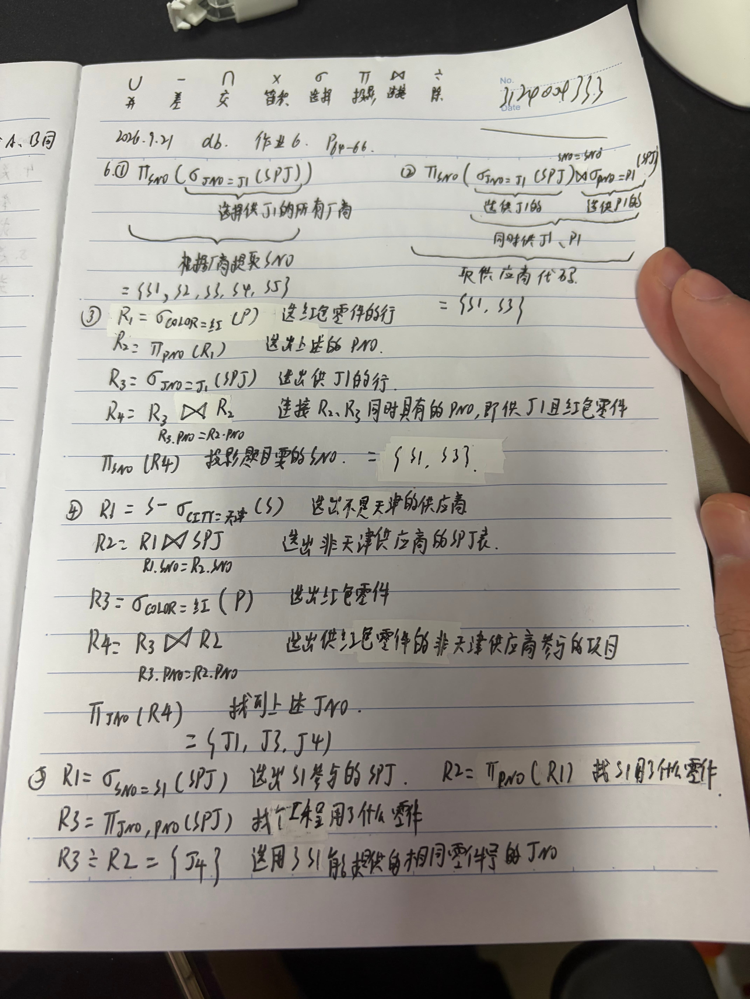
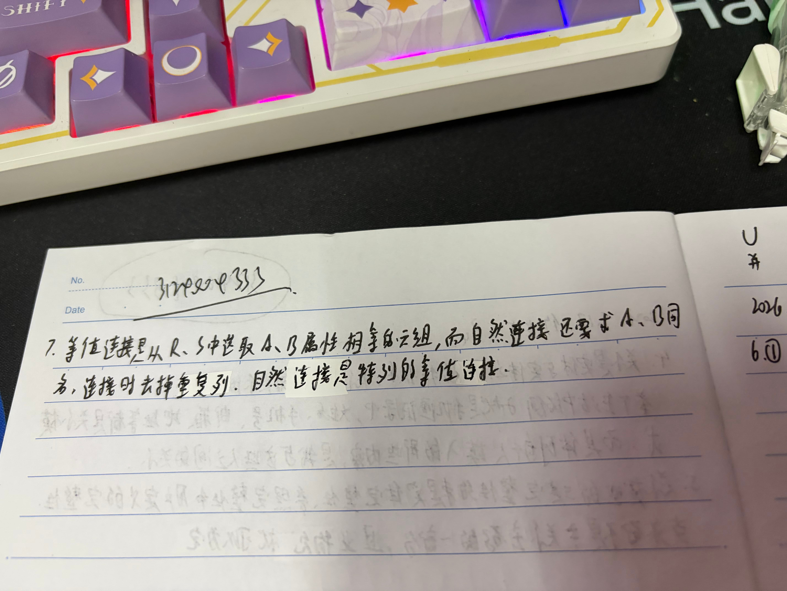

# 作业6

内容：第2章课后习题6 ，习题7
要求：

1. 只用关系代数完成查询，同时给出使用各个运算的原因，并给出运算的结果（包括运算的中间结果，如果数据元组太多可以仅给出代表元组）
2. 需要在纸张上答题并拍照，纸张上需要留有自己的信人信息。 照片压缩处理，单张照片文件大小不要超过1M。（也可以直接在手写板上做题）
3. 作业使用md格式保存信息，保存在作业根目录，文件名为“作业6.md”

## 作业解答

RT

