# 作业7

要求：
1. 使用MySQL完成教材上有关数据库，表，索引的创建、修改、删除等相关内容的实操。
2. 实验开始前将命令行窗口背景改为白色，字体改为黑色。
3. 修改提示符，包含自己的个人学学号信息。
4. 实验使用md格式保存截图信息，如果MySQL执行SQL失败，给出失败原因。文件名为“作业7.md”

## 个人解答

先按照要求改一下提示符

```sql
prompt 3124004333> 
```

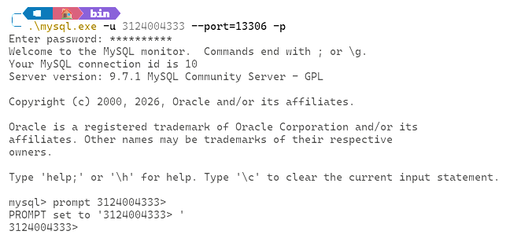

### 数据库的创建、修改与删除

新建一个数据库直接 CREATE 就行

```sql
CREATE DATABASE homework7;
```

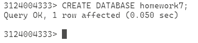

用 `DROP` 删除数据库

```sql
DROP DATABASE homework7;
```

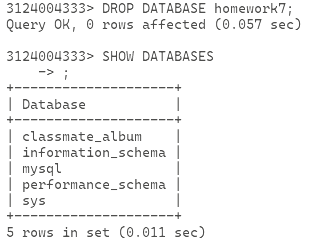

但是还是先加回来吧，这次的作业要用这个数据库

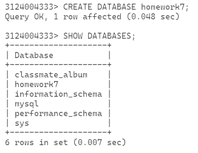

### 表格的创建、修改与删除

先指定要用的数据库，这里要用 `homework7` 这个数据库

```sql
USE homework7;
```

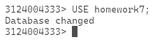

按照书本要求新建一个学生表

```sql
CREATE TABLE Student (
    Sno CHAR(8) PRIMARY KEY, 
    Sname VARCHAR(20) UNIQUE, 
    Ssex CHAR(6), 
    Sbirthdate Date, 
    Smajor VARCHAR(40)
);
```

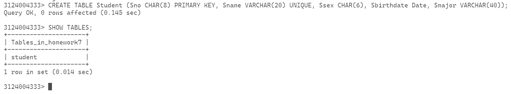

再建立课程表和选课表

```sql
CREATE TABLE Course (
    Cno CHAR(5) PRIMARY KEY, 
    Cname VARCHAR(40) NOT NULL, 
    Ccredit SMALLINT, 
    Cpno CHAR(5), 
    FOREIGN KEY (Cpno) REFERENCES Course(Cno)
);  --+ 这里新建了一个约束条件，让 Cpno 取参照 Course.Cno，下面同理，反正就是前面的参照后面表格的列
CREATE TABLE SC (
    Sno CHAR(8), 
    Cno CHAR(5), 
    Grade SMALLINT, 
    Semester CHAR(5), 
    Teachingclass CHAR(8), 
    PRIMARY KEY(Sno, Cno), 
    FOREIGN KEY (Sno) REFERENCES Student(Sno), 
    FOREIGN KEY (Cno) REFERENCES Course(Cno)
);
```

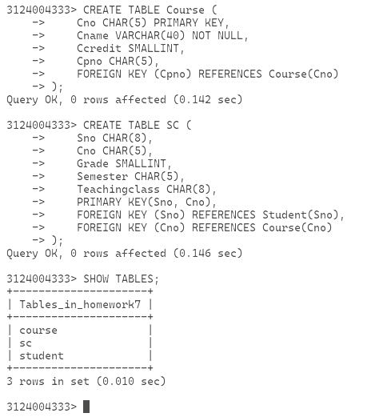

按照书上的说法，这里出现了一种 `S-C-SC` 模式（感觉有点类似书上的上次作业里的 PNO），但其实在 Mysql 中模式就是数据库，所以这里的 `S-C-SC` 模式在我的作业里应该是 `homework7` 模式

接下来是修改表格，用 `ALTER TABLE <table> OPERATION ...` 的语句就行

```sql
ALTER TABLE Student ADD Semail VARCHAR(30);
ALTER TABLE Student ALTER COLUMN Sbirthdate TYPE VARCHAR(20);
ALTER TABLE Course ADD UNIQUE(Cname);
```

其中第二句炸了

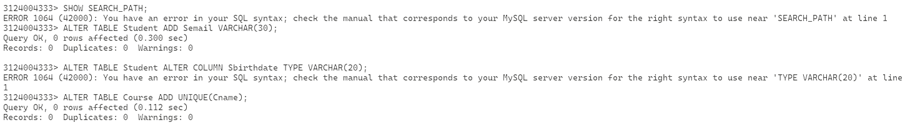

因为 Mysql 没有这种写法，PSQL 有，Mysql 应该写作

```sql
ALTER TABLE Student MODIFY COLUMN Sbirthdate VARCHAR(20);
```

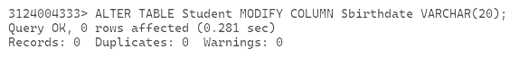

这里删除一下刚刚的 Student 表格吧，然后报错了，忘记 SC 表格有一个外键在 Student 上了

```sql
DROP TABLE Student;
```

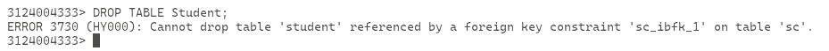

算了，删了重建吧

```sql
DROP TABLE SC;
DROP TABLE Course;
DROP TABLE Student;
CREATE TABLE Student (
    Sno CHAR(8) PRIMARY KEY, 
    Sname VARCHAR(20) UNIQUE, 
    Ssex CHAR(6), 
    Sbirthdate Date, 
    Smajor VARCHAR(40)
);
CREATE TABLE Course (
    Cno CHAR(5) PRIMARY KEY, 
    Cname VARCHAR(40) NOT NULL, 
    Ccredit SMALLINT, 
    Cpno CHAR(5), 
    FOREIGN KEY (Cpno) REFERENCES Course(Cno)
);
CREATE TABLE SC (
    Sno CHAR(8), 
    Cno CHAR(5), 
    Grade SMALLINT, 
    Semester CHAR(5), 
    Teachingclass CHAR(8), 
    PRIMARY KEY(Sno, Cno), 
    FOREIGN KEY (Sno) REFERENCES Student(Sno), 
    FOREIGN KEY (Cno) REFERENCES Course(Cno)
);
ALTER TABLE Student ADD Semail VARCHAR(30);
ALTER TABLE Student MODIFY COLUMN Sbirthdate VARCHAR(20);
ALTER TABLE Course ADD UNIQUE(Cname);
```

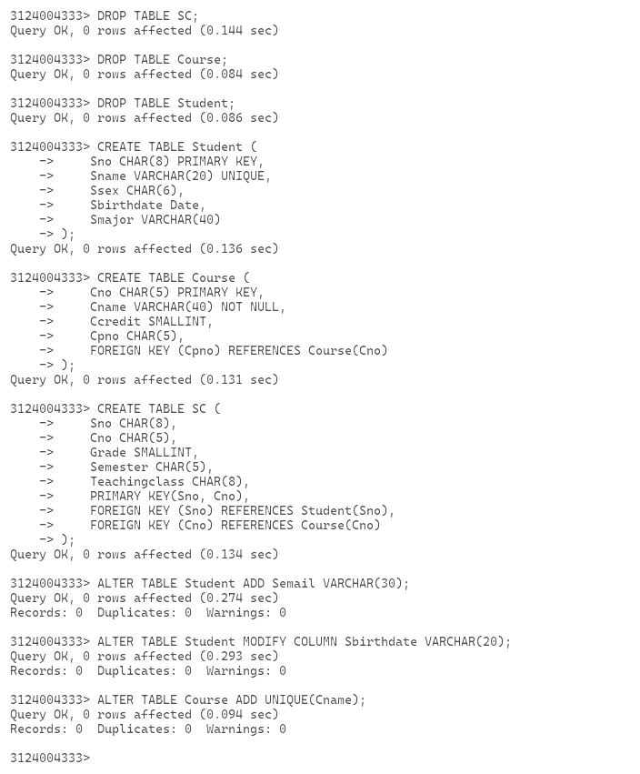

### 索引的建立与删除

按照书上的步骤走，所以是为了能够快速找到符合条件的行使用的

```sql
CREATE UNIQUE INDEX Idx_StuSname ON Student(Sname);
CREATE UNIQUE INDEX Idx_CouCname ON Course(Cname);
CREATE UNIQUE INDEX Idx_SCCno ON SC(Sno ASC, Cno DESC);
```

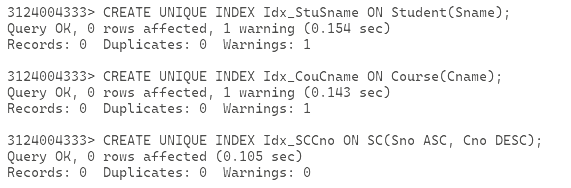

对索引进行修改，书上是重命名了

```sql
ALTER INDEX Idx_SCCno RENAME TO Idx_SCSnoCno;
```

但是吧，MySQL 不支持这个写法

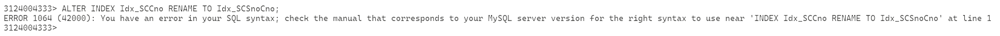

MySQL 要写作

```sql
ALTER TABLE SC RENAME INDEX Idx_SCCno TO Idx_SCSnoCno;
```

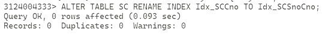

接下来删除索引

```sql
DROP INDEX Idx_StuSname;
```

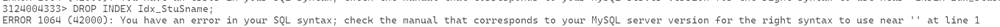

依旧不行，MySQL 的索引是表的一部分，所以要指定表

```sql
DROP INDEX Idx_StuSname ON Student;
```

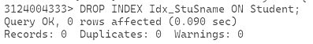