# 作业8

要求：
1. 实验开始前将命令行窗口背景改为白色，字体改为黑色。
2. 修改提示符，包含自己的个人学学号信息。
3. 使用SQL完成教材上学生选择信息数据库中学生表、课程表以及选择信息表的数据插入。
4. 完成教材上SQL查询实验到空值查询部分。
5. 实验使用md格式保存截图信息，如果MySQL执行SQL失败，给出失败原因。文件名为“作业8.md”

## 个人解答

先插入数据吧，插入了才有的查，上次创建的表格如下

```sql
CREATE TABLE `student` (
  `Sno` char(8) NOT NULL,
  `Sname` varchar(20) DEFAULT NULL,
  `Ssex` char(6) DEFAULT NULL,
  `Sbirthdate` varchar(20) DEFAULT NULL,
  `Smajor` varchar(40) DEFAULT NULL,
  `Semail` varchar(30) DEFAULT NULL,
  PRIMARY KEY (`Sno`),
  UNIQUE KEY `Sname` (`Sname`)
) ENGINE=InnoDB DEFAULT CHARSET=utf8mb4 COLLATE=utf8mb4_0900_ai_ci;
CREATE TABLE `course` (
  `Cno` char(5) NOT NULL,
  `Cname` varchar(40) NOT NULL,
  `Ccredit` smallint DEFAULT NULL,
  `Cpno` char(5) DEFAULT NULL,
  PRIMARY KEY (`Cno`),
  UNIQUE KEY `Cname` (`Cname`),
  UNIQUE KEY `Idx_CouCname` (`Cname`),
  KEY `Cpno` (`Cpno`),
  CONSTRAINT `course_ibfk_1` FOREIGN KEY (`Cpno`) REFERENCES `course` (`Cno`)
) ENGINE=InnoDB DEFAULT CHARSET=utf8mb4 COLLATE=utf8mb4_0900_ai_ci;
CREATE TABLE `sc` (
  `Sno` char(8) NOT NULL,
  `Cno` char(5) NOT NULL,
  `Grade` smallint DEFAULT NULL,
  `Semester` char(5) DEFAULT NULL,
  `Teachingclass` char(8) DEFAULT NULL,
  PRIMARY KEY (`Sno`,`Cno`),
  UNIQUE KEY `Idx_SCSnoCno` (`Sno`,`Cno` DESC),
  KEY `Cno` (`Cno`),
  CONSTRAINT `sc_ibfk_1` FOREIGN KEY (`Sno`) REFERENCES `student` (`Sno`),
  CONSTRAINT `sc_ibfk_2` FOREIGN KEY (`Cno`) REFERENCES `course` (`Cno`)
) ENGINE=InnoDB DEFAULT CHARSET=utf8mb4 COLLATE=utf8mb4_0900_ai_ci
```

按照书本 P108 的内容，插入一下数据

```sql
INSERT INTO Student (Sno, Sname, Ssex, Smajor, Sbirthdate)
VALUES ('20180009', '陈冬', '男', '信息管理与信息系统', '2000-5-22');
INSERT INTO Student VALUES ('20180008', '张成民', '男', '2000-4-15', '计算机科学与技术');  --+ 未显式表明列名，则按照创建表格的顺序进行插入
```

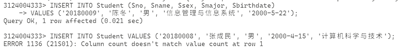

这里出现了问题，是因为我们的表中有 `Semail` 列，设定是 `VARCHAR(30) NOT NULL`，但是在没有提供列的时候是不可以忽略，必须按照对应的列插入的，所以这里插入五列会插入不进去

改一下，我也显式带一个 `NULL` 就行了

```sql
INSERT INTO Student VALUES ('20180008', '张成民', '男', '2000-4-15', '计算机科学与技术', NULL);
```

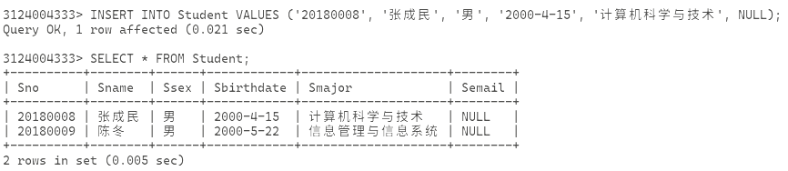

再学书上插入一条选课记录

```sql
INSERT INTO SC(Sno, Cno, Semester, Teachingclass)
VALUES ('20180005', '81004', '20202', '81004-01');
```

不出意外的报错了，因为外键不满足

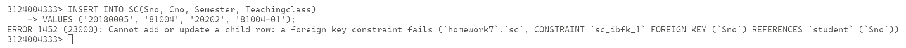

这里缺少学号为 `20180005` 的学生，所以新建一个学生吧

```sql
INSERT INTO Student VALUES ('20180005', '学生A', '男', '2000-1-1', '未知专业', NULL);
```

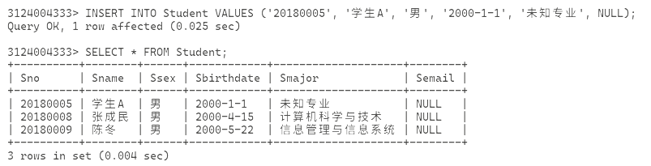

然后还是外键原因，我们缺少课程号为 `81004` 的课程，所以也加一个

```sql
INSERT INTO Course VALUES ('81004', '数据库系统', 2, '81004');
```

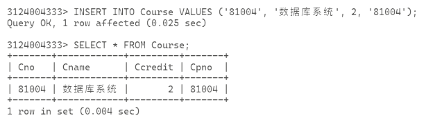

然后插入 SC

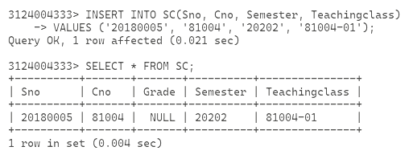

然后可以开始查询了，这里先给出各个表格当前的状态，为了好看，我这里用 Navicat 的截图

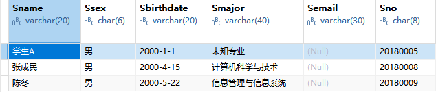

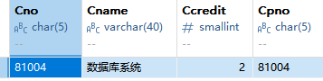

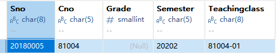

开始单表查询

```sql
SELECT Sno, Sname FROM Student;
```

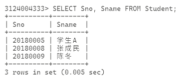

```sql
SELECT Sname, Sno, Smajor FROM Student;
```

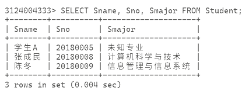

```sql
SELECT * FROM Student;
```

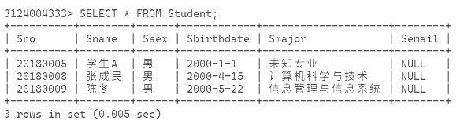

带表达式计算的查询，这里沿用书上的年龄计算

确认一下 `CURRENT_DATE` 是否可用，这个确实不记得了

```sql
SELECT CURRENT_DATE;
```

看到有输出

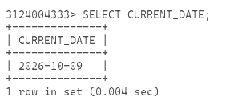

```sql
SELECT Sname, (EXTRACT(YEAR FROM CURRENT_DATE) - EXTRACT(YEAR FROM Sbirthdate)) AS '年龄' FROM Student;
```

这里对表达式起了个别名，不然表头会很长不好看（RT）

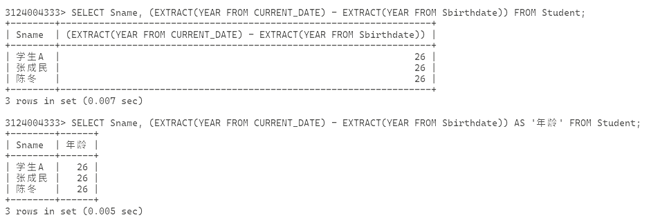

带文字的查询

```sql
SELECT Sname, 'Date of Birth:', Sbirthdate, Smajor FROM Student;
```

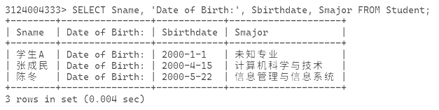

下面这个查询涉及到重复的学号，先新建多一个课程和选课记录

```sql
INSERT INTO Course VALUES ('81003', '计算机组成原理', '2', '81003');
INSERT INTO SC VALUES ('20180005', 81003, NULL, '20202', '81003-01');
INSERT INTO SC VALUES ('20180008', 81004, NULL, '20202', '81004-01');
```

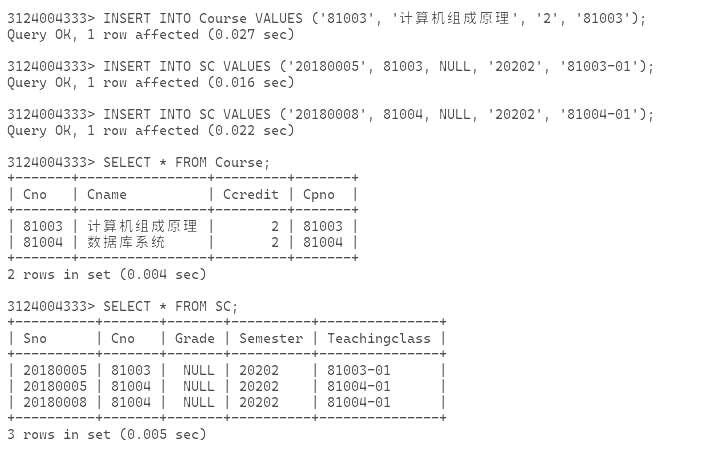

从 SC 里查 Sno

```sql
SELECT Sno FROM SC;
```

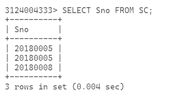

有重复的，带上 `DISTINCT` 关键词

```sql
SELECT DISTINCT Sno FROM SC;
```

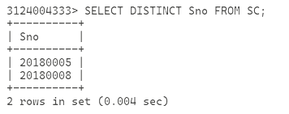

没有重复了，达到了我们的目的，接着查询满足条件的，这里在 Course 查询 `Cno=81004` 的课程

```sql
SELECT * FROM Course WHERE Cno = '81004';
```

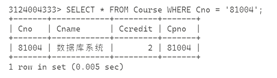

查询出生月份大于 1 的学生，毕竟我这里的 YEAR 全都是 2000，分不开

```sql
SELECT * FROM Student WHERE EXTRACT(MONTH FROM Sbirthdate) > 1;
```

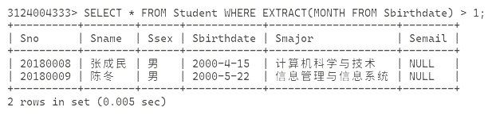

多条件查询，加多学号是 `20180008`

```sql
SELECT * FROM Student WHERE EXTRACT(MONTH FROM Sbirthdate) > 1 AND Sno = '20180008';
```

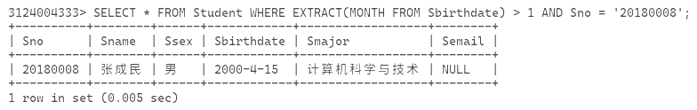

类似于 Python 的 `in list[]` 的这种判断条件，用 `IN` 可以查询在元组内的

```sql
SELECT * FROM Student WHERE Smajor IN ('计算机科学与技术', '信息管理与信息系统');
```

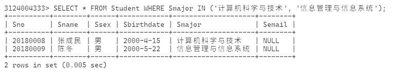

字符匹配查询，用 `%` 表示任意长度字符串，`_` 表示单个字符字符串，例如

```sql
SELECT * FROM Student WHERE Sname LIKE '张%';
SELECT * FROM Student WHERE Sname LIKE '陈_';
```

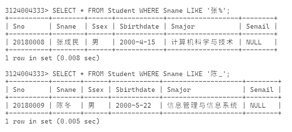

用 `ORDER BY` 排序

```sql
SELECT * FROM SC ORDER BY Sno DESC;
```

刚好对比一下有 ORDER 和没 ORDER

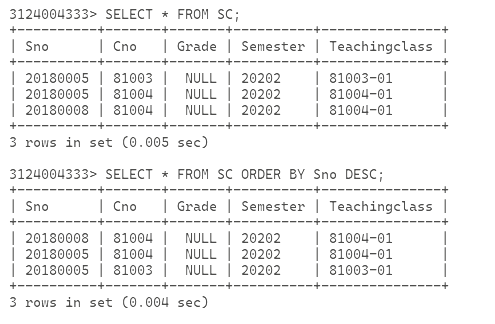

使用聚集函数（各种成型的计算函数）查询，这里其实没什么好算的，干脆就算一下总和吧

```sql
SELECT MAX(Ccredit) FROM Course;
SELECT SUM(Ccredit) FROM Course;
SELECT AVG(Ccredit) FROM Course;
```

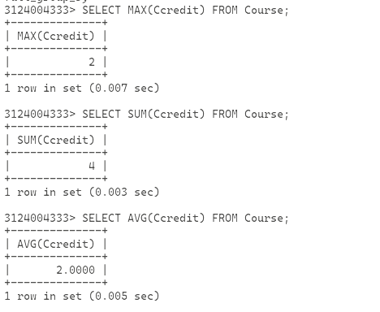

用 GROUP BY 分组

```sql
SELECT * FROM SC GROUP BY Cno;
```
